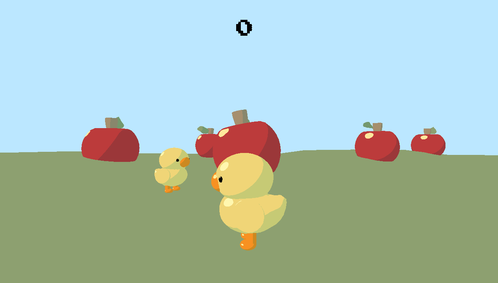

# Ducky Munchies

Author: Taylor Kynard

Design: Eat as many apples as you can before your opponent does - as ducks!

Networking: (TODO: How does your game implement client/server multiplayer? What messages are transmitted? Where in the code?)
The code calculates the player positions, rotation, and states (eaten an apple or not) on the client side and sends those over to the server, the server then sends everyone's information back to each client to calculate what to render on their screen. 

Screen Shot:

How To Play:

walk towards an apple, when you collide with it, it will dissapear and you will get a point!

Sources: Made everything myself again :> (reused assets)

This game was built with [NEST](NEST.md).

